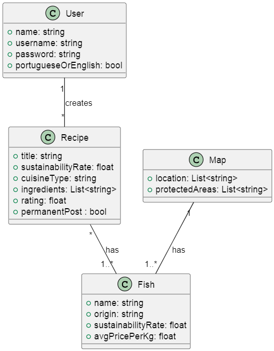
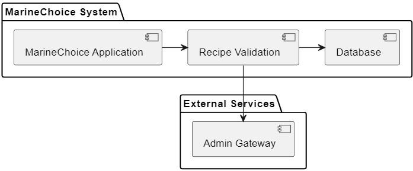
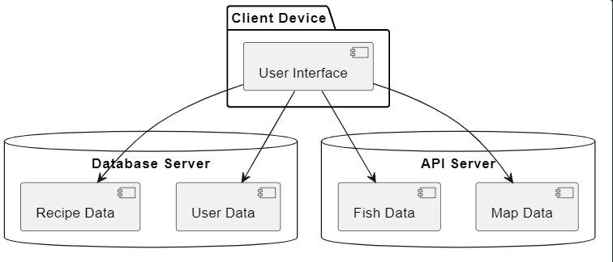

## MarineChoice Development Report 

Welcome to the documentation pages of the MarineChoice!

You can find here details about the MarineChoice, from a high-level vision to low-level implementation decisions, a kind of Software Development Report, organized by type of activities:

- Business modeling
    - ([Product Vision](https://github.com/FEUP-LEIC-ES-2023-24/2LEIC14T1/blob/master/README.md#product-vision))
    - Features and Assumptions
    - Elevator Pitch
- Requirements
    - User stories
    - Domain model
- Architecture and Design
    - Logical architecture
    - Physical architecture
    - Vertical prototype
- Project management

Contributions are expected to be made exclusively by the initial team, but we may open them to the community, after the course, in all areas and topics: requirements, technologies, development, experimentation, testing, etc.

Please contact us!

Thank you!

Cláudia Mesquita ([up202206173@fe.up.pt](mailto:up202206173@fe.up.pt))
José Santos ([up202108673@fe.up.pt](mailto:up202108673@fe.up.pt))
Luana Lima ([up202206845@fe.up.pt](mailto:up202206845@fe.up.pt))
Pedro Costa ([up202206180@fe.up.pt](mailto:up202206180@fe.up.pt))
Pedro Lunet ([up202207150@fe.up.pt](mailto:up202207150@fe.up.pt))

## Business Modelling

### Product Vision

MarineChoice has the goal to empower seafood consumers with the knowledge and tools to make sustainable choices, in regards to their eating habits. Our app provides insights into harmful fishing practices, offers delicious recipes using sustainable fish, and fosters a community of environmentally-conscious individuals. Together, we're shaping a future where every seafood choice supports healthy oceans.

### Features and Assumptions

- Classify fish by sustainability: Organize fish species into categories indicating their sustainability status, allowing users to make informed choices about what seafood to consume.

- Login and Register: Provide a system for users to create accounts and log in, so they can use the application.

- Choose language for app: Allow users to select their preferred language between English and Portuguese, to enhance accessibility and usability.

- Give detailed information about species: Offer comprehensive details about each fish species, including habitat, nutrition, and cooking methods, aiding users in understanding their seafood choices.

- Give detailed information about why sustainability is important:  Educate users on the significance of sustainable fishing practices, emphasizing their impact on ecosystems and food security.

- Create an interactive map with several fishes' original fishing locations: Develop an interactive map showing the native fishing areas of various fish species, enhancing users' understanding of seafood origins.

- Give recipes that use sustainable fish: Provide a collection of recipes centered around sustainable seafood options, encouraging responsible consumption through delicious meal ideas.

- Create a post wall where users can share recipes: Establish a platform for users to share their favorite seafood recipes and cooking tips, fostering community engagement and knowledge exchange.

- Rate recipes: Enable users to rate and review recipes, facilitating recipe discovery and feedback sharing within the community.

- Search for specific type of cuisine: Implement a search feature allowing users to find recipes based on cuisine type, catering to diverse culinary preferences. 

- Filter Ingredients:  Incorporate filters for users to search recipes based on specific ingredients or dietary restrictions, enhancing customization and convenience in recipe discovery.

### Elevator Pitch

(...)

### Requirements

(...)

### Domain Model

### Architecture and Design

(...)

### Logical Architecture

### Physical Architecture

### Vertical Prototype

(...)
